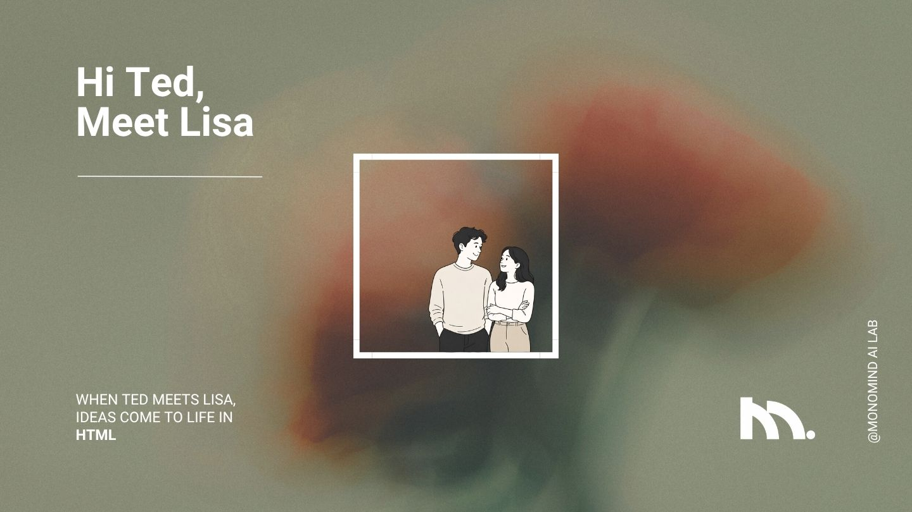

# Lisa's PPT — 문서를 넣으면, PowerPoint에서 진짜 편집되는 PPT가 나옵니다

<p align="left">
  
</p>

[English](README.md) · **한국어** · [繁體中文](README_ZH-TW.md)

> 이 저장소는 [Hi Ted, Meet Lisa](https://github.com/monomind-ai-lab/hi-ted-meet-lisa)의 **PowerPoint 쪽**입니다. [hugohe3/ppt-master](https://github.com/hugohe3/ppt-master)(MIT) v6.1.0을 엔진으로 한 번 들여오고, 그 위에 [byungjunjang/slide-master](https://github.com/byungjunjang/slide-master)(MIT)의 개선점을 옮겨 심은 하드 포크입니다. 원 프로젝트들의 라이선스와 저작권 고지는 그대로 유지합니다. 스킬로 설치해서 씁니다. 웹 모드는 없습니다.

---

## 이게 뭔가요? (1분 요약)

- **무엇**: Claude Code, Codex 같은 AI 코딩 에이전트 안에서 도는 **PPT 생성 워크플로우(스킬)** 입니다. 별도의 앱이나 웹서비스가 아니라, 채팅으로 시키면 AI가 정해진 절차를 따라 내 컴퓨터에서 파일을 만들어 줍니다.
- **입력**: PDF · DOCX · 웹 URL · Markdown · 엑셀/CSV, 혹은 그냥 **주제 한 문단**
- **출력**: PowerPoint에서 **요소 하나하나 클릭해서 고칠 수 있는 네이티브 `.pptx`** — 도형·텍스트·차트가 이미지가 아니라 진짜 PowerPoint 개체입니다. 발표자 노트, 페이지 전환, (원하면) 음성 나레이션까지 담깁니다.
- **과정**: AI가 자료를 읽고 → 브라우저 확인 페이지에서 방향과 디자인을 나와 함께 정하고 → 페이지를 SVG로 한 장씩 그린 뒤 → 자체 변환기로 PPTX를 만듭니다.

Hi Ted, Meet Lisa는 HTML 파일 한 장을 만듭니다. 그런데 어떤 자리는 `.pptx`를 원합니다. 글자를 클릭해서 고치고, 차트에서 "데이터 편집"을 누르고, 아무것도 더 깔지 않은 PowerPoint에서 그냥 열리는 파일. Lisa's PPT는 그 파일을 만듭니다.

사용 예:

> "projects/에 넣어둔 3분기 보고서 PDF로 임원 보고용 PPT 만들어줘"

↓ (방향/디자인 확인 후 자동 진행)

```
projects/<프로젝트>/exports/<제목>_ver1.pptx          ← PowerPoint에서 바로 열어 편집 (재수출 시 ver2, ver3…)
projects/<프로젝트>/svg_final/                        ← 브라우저로 보는 페이지별 미리보기
```

---

## 다른 AI PPT 도구와 뭐가 다른가요?

**PowerPoint에서 열어서 고칠 수 없으면 PPT가 아니다** — 이 워크플로우의 기본 철학입니다.

| 방식 | 결과물 | PowerPoint에서 요소별 편집? |
|---|---|:---:|
| 템플릿 채우기형 | 고정 템플릿에 텍스트만 채운 PPTX | 템플릿 한계 안에서만 |
| 이미지형 | 슬라이드 = 큰 그림 한 장 | ❌ 그림이라 못 고침 |
| HTML형 | 브라우저에서 여는 파일 한 장. Hi Ted, Meet Lisa가 만드는 것이 이것입니다 | ❌ PPTX가 아님 — 그래서 이 저장소가 있습니다 |
| **네이티브 편집형 (Lisa's PPT)** | **진짜 DrawingML 도형·텍스트·차트** | ✅ 아무 요소나 클릭해서 편집 |

- **비용이 투명합니다** — 도구는 MIT·오픈소스이고, 드는 건 내가 쓰는 AI 모델 사용료뿐입니다. 이미지 생성은 Codex 로그인 하나면 되고, API 키는 필요 없습니다.
- **데이터가 로컬에 남습니다** — AI 모델과의 통신을 빼면 전 과정이 내 컴퓨터에서 실행됩니다. 변환 서버가 없습니다.
- **플랫폼에 묶이지 않습니다** — Claude Code, Codex(CLI · ChatGPT 데스크탑 앱), Cursor, VS Code Copilot 등 파일 읽기/쓰기 + 명령 실행이 되는 에이전트에서 동작합니다.
- **내보낼 때마다 번호가 붙습니다** — `<제목>_ver1.pptx`, 다음은 `_ver2`. 잘 나온 판을 덮어쓰지 않습니다.
- **차트와 표는 진짜 개체로도 뽑힙니다** — `--native-charts-and-tables`를 붙이면 PowerPoint 차트·표 개체가 되어 "데이터 편집"이 열립니다(`_native_charts_tables` 판으로 따로 저장).
- **한국어 자리에 맞춘 레이아웃 일곱 개** — `academic_defense`, `government_blue`, `government_red`, `medical_university`, `psychology_attachment`, `ai_ops`, `pixel_retro`. 업스트림의 일곱 개 옆에 그대로 있습니다. 여기에 Lisa의 토큰으로 만든 `monomind` 브랜드와 하우스 스타일 둘(`evidence-deck`, `paper-brief`)이 더 있습니다.
- **확인 화면이 한국어로 나옵니다** — 영어와 번체 중국어도요(업스트림의 간체 중국어·일본어도 그대로). 어느 언어로 읽든 답은 카탈로그의 같은 id로 저장되어, 화면 언어가 덱에 스며들지 않습니다.

> **만능 요술램프는 아닙니다.** 결과 품질의 천장은 모델이 정합니다(대용량 컨텍스트의 Claude 권장). 한 번에 완벽한 덱을 기대하기보다는 — 지루한 작업 대부분을 AI가 해오고, 마지막 다듬기는 편집 가능한 PPTX 위에서 직접 하는 도구라고 생각하면 정확합니다.

---

## 어떻게 동작하나요?

```
원본 문서 → 프로젝트 생성 → [템플릿] → 전략 확인(브라우저) → [이미지 생성]
        → SVG 페이지 작성 + 라이브 프리뷰 → 품질 검사(겹침·넘침·줄바꿈 자동 검출) → 후처리 → PPTX 내보내기
```

| 단계 | 내가 하는 일 |
|---|---|
| 전략 확인 | 브라우저에 열리는 확인 페이지에서 2단계(커뮤니케이션 계약 → 최종 플랜과 제작)로 캔버스·페이지 수·레이아웃 또는 브랜드·색·폰트·이미지 방식을 고릅니다. 색상 견본과 폰트 미리보기를 직접 보면서 선택. 첫 단계에서 내장 레이아웃·브랜드·스타일을 골라 시작할 수도 있습니다 |
| 생성 중 | 라이브 프리뷰로 슬라이드가 만들어지는 걸 실시간으로 보고, 고칠 부분은 화면에 클릭 주석으로 남기면 AI가 반영 |
| 완료 후 | `exports/`의 PPTX를 열어 확인. 필요하면 채팅으로 "4페이지 차트를 막대로 바꿔줘"처럼 계속 다듬기 |

### 폰트 — 언어마다 한 가족

한국어 덱은 **Pretendard**, 번체 중국어 덱은 **Noto Sans TC**, 영어 덱은 **Plus Jakarta Sans** 한 가족으로 통일됩니다. id와 코드에는 **JetBrains Mono**. 위계는 폰트를 바꾸는 게 아니라 굵기(Medium/SemiBold/Bold)와 크기, 자간, 색으로 만듭니다. 변환기는 CJK 가족을 라틴 슬롯과 동아시아 슬롯 양쪽에 등록해서, 한글과 영문이 섞인 줄에서 PowerPoint가 한쪽을 다른 폰트로 바꿔치기하지 못하게 합니다. 폰트 파일은 SIL OFL 전문과 함께 [`skills/lisa-ppt/assets/fonts/`](skills/lisa-ppt/assets/fonts/)에 번들되어 있고, 프롬프트는 번들된 굵기만 부릅니다.

> PPTX는 폰트를 내장하지 않으므로, 만든 덱을 **다른 컴퓨터에서 열 때는 그쪽에도 같은 가족 설치**가 필요합니다. 아래 설치 5단계가 그 일을 합니다.

---

## 설치 (10분)

**1단계 — Python 3.10 ~ 3.14**

[python.org](https://www.python.org/downloads/)에서 설치할 때 **"Add to PATH" 체크** 필수. Windows는 [단계별 가이드](docs/windows-installation.md) 참고. Node는 필수가 아닙니다 — 이미지를 그리는 Codex CLI만 Node 도구이고, 그것도 선택입니다.

**2단계 — AI 에이전트**

[Claude Code](https://claude.ai/code)(CLI 또는 VS Code/JetBrains 확장) 권장 — 가장 많이 검증된 환경입니다. **Codex도 지원합니다** — Codex CLI든 ChatGPT 데스크탑 앱의 Codex든, 이 저장소 폴더를 열기만 하면 됩니다. Codex용 실행 규칙([`AGENTS.md`](AGENTS.md))과 스킬 발견 스텁(`.codex/skills/`)이 저장소에 이미 포함되어 있어 별도 설정이 필요 없습니다.

**3단계 — 스킬 설치**

한 번 깔면 `/lisa-ppt`가 계속 내 명령이 됩니다.

```sh
/plugin marketplace add monomind-ai-lab/lisa-ppt
/plugin install lisa-ppt@monomind-ppt
```

Codex에서는 한 줄입니다.

```sh
codex plugin marketplace add monomind-ai-lab/lisa-ppt
```

Agent Skills 규약을 따르는 다른 에이전트라면:

```sh
npx skills add monomind-ai-lab/lisa-ppt
```

아니면 저장소를 받아서 그 폴더를 에이전트에서 엽니다. 스킬 셋(`lisa-ppt`, `codex-image`, `diagram-design`)은 `skills/`에 있고, Codex용 스텁이 `.codex/skills/`에 같이 생성되어 있습니다.

```bash
git clone https://github.com/monomind-ai-lab/lisa-ppt.git
cd lisa-ppt
pip install -r requirements.txt
```

**4단계 (선택) — AI 이미지 생성**

Codex CLI를 깔고 한 번 로그인하면 끝입니다. API 키 없이 Codex의 `image_gen`으로 그립니다. `IMAGE_BACKEND`를 비워 두면 그게 기본값이고, API 키 방식 백엔드는 환경변수로 고를 수 있습니다.

```bash
# A) Codex CLI OAuth (API 키 불필요)
npm install -g @openai/codex
codex login

# B) API 키 — 환경변수 또는 .env에 OPENAI_API_KEY / GEMINI_API_KEY 등
```

**5단계 — 폰트 설치**

덱을 만들거나 여는 컴퓨터마다 한 번. macOS·Windows·Linux 모두 사용자 수준으로 설치합니다.

```bash
python3 skills/lisa-ppt/scripts/install_fonts.py            # --dry-run 은 계획만, --check 는 설치 여부만
```

---

## 가장 흔한 사용 패턴

전부 채팅에 자연어로 말하면 됩니다 — 경로 선택은 AI가 알아서 합니다.

| 상황 | 이렇게 말하면 | 내부 경로 |
|---|---|---|
| 자료로 새 덱 만들기 | `/lisa-ppt projects/q3/sources/실적보고.pdf로 임원 보고 10장, 절제된 톤으로` | 메인 파이프라인 |
| 주제만 있고 자료가 없음 | `/lisa-ppt RAG를 비개발자에게 설명하는 덱. 자료는 네가 찾아서` | 웹 리서치 후 메인 파이프라인 |
| 갖고 있는 PPTX 템플릿에 내용 채우기 | "sources/회사템플릿.pptx 디자인 그대로, sources/기획안.md 내용으로 채워줘" | [`edit-native-pptx`](skills/lisa-ppt/workflows/edit-native-pptx.md) — 원본 디자인 그대로, 안 바뀐 페이지는 바이트 단위로 보존 |
| 기존 PPT를 페이지 그대로 예쁘게 | "이 PPT 문구/순서 유지하고 레이아웃만 개선해줘" | [`beautify-pptx`](skills/lisa-ppt/workflows/profiles/beautify-pptx.md) — 1:1 유지 |
| 완성 덱에 노트·나레이션·전환 추가 | "exports/덱_ver2.pptx에 발표자 노트랑 음성 나레이션 넣어줘" | [`edit-native-pptx`](skills/lisa-ppt/workflows/edit-native-pptx.md) — `_narrated` 판으로 내보냄 |
| PPTX/디자인을 재사용 템플릿으로 | "이 덱으로 재사용 템플릿 만들어줘" | [`create-template`](skills/lisa-ppt/workflows/create-template.md) |
| 생성된 페이지 시각 자체 검토 | "페이지별로 시각 검토 돌려줘" | [`visual-review`](skills/lisa-ppt/workflows/stages/visual-review.md) |

---

## 실전 시나리오

**A. 보고서 PDF → 임원 보고 덱**

```
projects/q3/sources/실적보고.pdf 로 10페이지 내외 임원 보고 PPT 만들어줘.
핵심 KPI 강조하고, 톤은 절제된 컨설팅 스타일로.
```

**B. 주제 한 줄 → 리서치 + 강의 덱**

```
"RAG가 뭔지 비개발자에게 설명하는 PPT" 만들어줘. 자료는 네가 조사해서.
```

**C. 회사 표준 템플릿 + 새 내용**

```
sources/회사표준템플릿.pptx 디자인 그대로 쓰고,
아래 붙여넣는 기획안 내용으로 채워줘. 안 맞는 페이지는 빼도 돼.
```

**D. 만든 덱 다듬기 → 재수출**

```
(라이브 프리뷰에서 3페이지에 "간격 넓혀줘" 주석 남긴 뒤)
주석 반영해서 다시 내보내 줘.
```

---

## FAQ

**Q. 진짜 편집이 되나요, 그림을 PPT에 붙인 건 아닌가요?**

**A.** 진짜 편집됩니다. SVG를 DrawingML로 직접 변환하므로 텍스트 상자·도형·차트가 전부 네이티브 PowerPoint 개체입니다. 색·위치·문구 모두 PowerPoint에서 수정 가능합니다. 차트/표를 데이터가 연결된 진짜 PowerPoint 차트 개체로 뽑는 옵션(`--native-charts-and-tables`)도 있습니다.

**Q. 결과가 마음에 안 들면요?**

**A.** 안전망은 네 겹입니다 — ① 생성 직후 **자동 지오메트리 게이트**: 텍스트 겹침·캔버스 이탈·어색한 줄바꿈을 글리프 폭 산수로 검출해 AI가 스스로 수정합니다(플래그된 페이지는 픽셀 렌더로 한 번 더 육안 확인), ② 생성 중 라이브 프리뷰에서 클릭 주석으로 즉시 수정 요청, ③ 명시 요청 시 페이지별 AI 시각 자체검토(`visual-review`), ④ 수출 후 `pptx_delivery_check.py`가 파일을 다시 읽어 패키지 무결성과 이식성을 점검. 그리고 최종 결과물이 편집 가능한 PPTX라서 언제든 직접 고칠 수 있습니다.

**Q. 우리 회사 템플릿/브랜드 컬러를 쓸 수 있나요?**

**A.** 네, 두 가지 방법으로요. 기존 PPTX에 내용만 채우는 건 Edit Native PPTX(디자인 원본 유지), 브랜드 아이덴티티(색/폰트/로고)를 재사용 프리셋으로 만드는 건 create-brand/create-template 워크플로우입니다. 자세한 건 [템플릿 가이드](docs/templates-guide.md) 참고.

**Q. 비용은 얼마나 드나요?**

**A.** 도구 자체는 무료입니다. 드는 건 연결한 AI 모델 사용료뿐이고, 덱 분량·이미지 생성 여부에 따라 달라집니다. 모델 선택 팁은 [FAQ 문서](docs/faq.md) 참고.

**Q. 내 문서가 어딘가에 업로드되나요?**

**A.** AI 모델과의 대화에 들어가는 내용 외에는 전부 로컬에서 처리됩니다. 변환·생성·수출 스크립트는 모두 내 컴퓨터에서 실행됩니다.

**Q. 수식은요?**

**A.** OMML로 나가고 PowerPoint에서 편집됩니다. Keynote, WPS, LibreOffice는 계약 밖입니다. SmartArt는 일부러 뺐습니다.

**Q. 투명 배경 이미지는요?**

**A.** gpt-image-2는 투명 배경을 못 그립니다 — 투명하게 해 달라고 하면 체커보드를 그려 옵니다. `codex-image` 스킬이 프롬프트를 고쳐 쓰고 그 사실을 알려 줍니다. 가능하면 단색 배경으로 부탁하세요.

**Q. 이 저장소는 어떻게 업데이트하나요?**

**A.** `git pull`(또는 플러그인 재설치)이면 됩니다. 업스트림에서 자동으로 끌어오는 건 없습니다 — 업스트림 리모트도, 업데이트 스크립트도 없고, 나중에 손으로 옮겨 오는 수정이 생기면 어떤 커밋에서 왔는지 [`NOTICE`](NOTICE)에 적습니다.

---

## Lisa와 오가는 두 갈래 (진행 중)

둘 다 각자의 브랜치에서 만들고 있고, 아직 이 트리에는 없습니다.

- **Lisa에서 여기로.** `/lisa`의 확인 화면에 Lisa's PPT가 `PPTX` 배지를 단 외부 카드로 올라올 예정입니다. 그걸 고르면 Lisa에게 준 브리프와 답이 첫 단계의 계약으로 넘어오고, `monomind` 브랜드가 선택된 채 시작합니다. 이 플러그인이 깔려 있어야 합니다.
- **Lisa의 파일에서 여기로.** `/lisa-ppt 덱.html`이 완성된 Lisa 덱을 읽게 됩니다. 파일 안의 `LISA:CONTENT-START/END` 구역이 프로젝트의 원본 Markdown이 되고, 토큰 블록이 미리 채워진 `design_spec.md`가 되어, HTML과 같은 말·같은 색의 `.pptx`가 나옵니다.

---

## 폴더 구조

| 경로 | 내용 |
|---|---|
| [`AGENTS.md`](AGENTS.md) / [`CLAUDE.md`](CLAUDE.md) | AI 에이전트가 읽는 프로젝트 진입점 (라우팅 경계·폰트 정책) |
| [`skills/lisa-ppt/`](skills/lisa-ppt/) | 워크플로우 본체 — [`SKILL.md`](skills/lisa-ppt/SKILL.md)(절차 권위), `references/`(역할 정의), `scripts/`(변환·검사 도구), `workflows/`(경로와 단계), `templates/`(레이아웃·브랜드·스타일·아이콘), `assets/fonts/`(번들 폰트) |
| `skills/codex-image/`, `skills/diagram-design/` | 벤더링한 스킬 둘. 각 디렉토리에 업스트림 라이선스 전문 동봉 |
| `.codex/skills/` | Codex용 스텁. 생성 파일이라 손대지 않습니다 |
| `projects/` | 내 작업 공간 — 프로젝트마다 `sources/`, `design_spec.md`, `notes/`, `images/`, `svg_output/`, `svg_final/`, `exports/`. 커밋되지 않습니다 |
| [`docs/`](docs/) | 사용자 문서 (FAQ · 설치 · 기술 설계 · 템플릿 가이드) |

---

## 문서

| | 문서 | 내용 |
|---|---|---|
| 📘 | [Getting Started](docs/getting-started.md) | 첫 덱 만들기 3단계, 템플릿·프리뷰·애니메이션·나레이션 사용법 |
| 🪟 | [Windows Installation](docs/windows-installation.md) | Windows 단계별 설치 가이드 |
| ❓ | [FAQ](docs/faq.md) | 모델 선택, 비용, 레이아웃 문제 해결 |
| 🏗️ | [Technical Design](docs/technical-design.md) | 아키텍처, 왜 SVG를 거치는가 |
| 🎨 | [Templates Guide](docs/templates-guide.md) | 브랜드/스타일/레이아웃/덱 템플릿 만들고 쓰기 |
| 🔊 | [Audio Narration](docs/audio-narration.md) | 음성 나레이션·자동 넘김 덱 만들기 |
| 📖 | [SKILL.md](skills/lisa-ppt/SKILL.md) | 핵심 워크플로우 규칙 (AI가 따르는 절차 원문) |

---

<p align="left">
  
</p>

---

## 기술 스택

- **Python 3.10 ~ 3.14** — 변환·검사·후처리 스크립트 전부. 3.14는 `skia-pathops`·`uharfbuzz`의 abi3 휠로 확인했고, 파이프라인은 3.11에서 돌립니다
- **자체 SVG → DrawingML 변환기** — 래스터화 없이 네이티브 PPTX 생성
- **Pretendard · Noto Sans TC · Plus Jakarta Sans · JetBrains Mono** (SIL OFL) — 언어별 하우스 폰트, 저장소에 번들
- **Playwright + Chromium** — 지오메트리 게이트의 선별 픽셀 확인·시각 검토용 페이지 렌더링 (선택 — 없으면 정적 검사만 동작)
- **Tabler / Phosphor / Simple Icons** — 내장 아이콘 라이브러리 11,801개 (48 MB). 저장소는 받으면 약 90 MB, 풀면 약 70 MB입니다

---

## 어디서 왔나요?

두 번 들여오고, 그다음은 독립입니다.

1. **PPT Master v6.1.0** (`hugohe3/ppt-master`, 커밋 `c40bca58`, 2026-08-31). 커밋 하나로 들여왔습니다. 페이지당 SVG 파이프라인, DrawingML 변환기, OMML 수식 모듈, 하이퍼링크 보존, `svg_quality` 검사기, 도형 병합과 텍스트 셰이핑.
2. **slide-master** (`byungjunjang/slide-master`, 커밋 `166472b`, 2026-08-04). 파일 단위로, 커밋 하나씩 옮겼습니다. Codex 이미지 백엔드와 투명 배경 규칙, `_ver<N>` 내보내기, 레이아웃 일곱 개, `instagram` 캔버스, 한국어 확인 화면 문구와 README, 한 가족 폰트 규칙, 스텁 동기화, `diagram-design` 벤더링 방식.

업스트림 리모트도, 업데이트 스크립트도, 런타임 출처 검사기도 없습니다. `NOTICE`가 장부입니다. 들여온 두 지점, 옮긴 파일 전부, 나중에 손으로 옮긴 수정과 그 출처 커밋.

## 라이선스

[MIT](LICENSE). 전체 사슬은 [`NOTICE`](NOTICE)에 있습니다.

- PPT Master, Copyright (c) 2025-2026 Hugo He, MIT
- slide-master, byungjunjang, MIT. 이름·URL·들여온 커밋으로 표기
- [`skills/codex-image/`](skills/codex-image/) — [wjb127/codex-image](https://github.com/wjb127/codex-image) 기반 (MIT, Copyright (c) 2026 wjb127). 라이선스 전문 동봉
- [`skills/diagram-design/`](skills/diagram-design/) — [cathrynlavery/diagram-design](https://github.com/cathrynlavery/diagram-design) 기반 (MIT, Copyright (c) 2025 Cathryn Lavery). 라이선스 전문 동봉
- Pretendard, Noto Sans TC, Plus Jakarta Sans, JetBrains Mono — SIL Open Font License 1.1. 라이선스 전문은 폰트 파일 옆에
- Lisa's PPT, Copyright (c) 2026 MonoMind AI Lab, MIT

Lisa's PPT는 [html.monomind.one](https://html.monomind.one)에서 HTML 템플릿들 옆에 올라갈 예정입니다.
